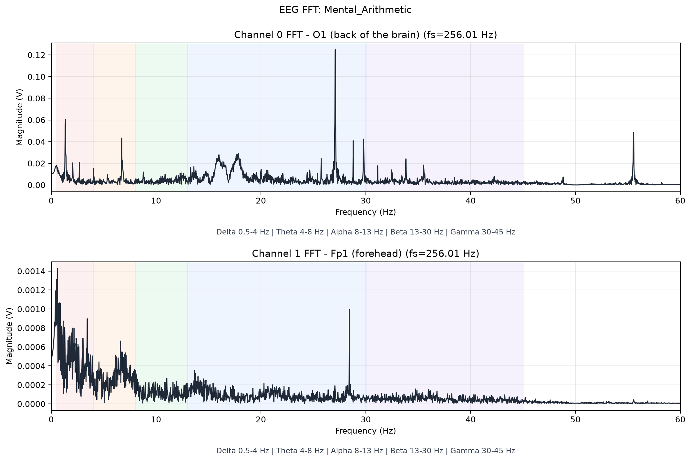
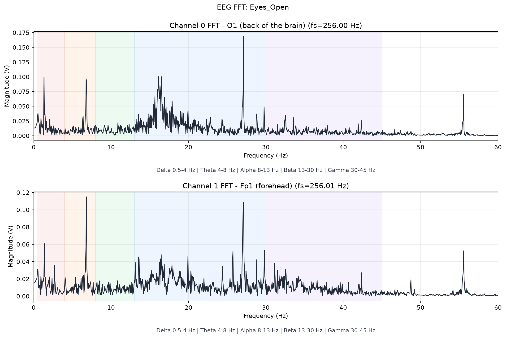
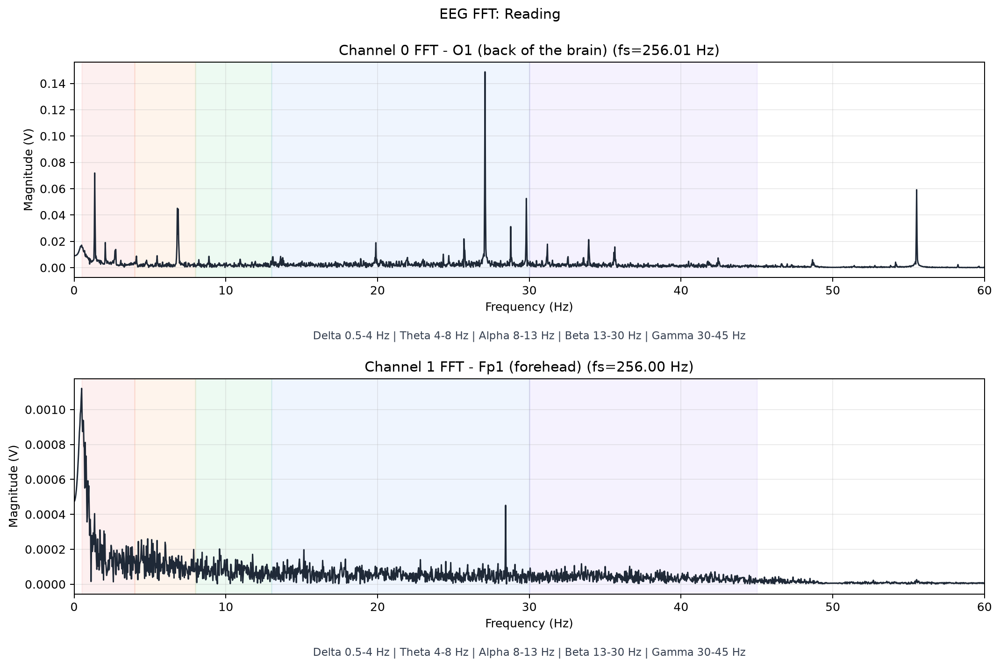
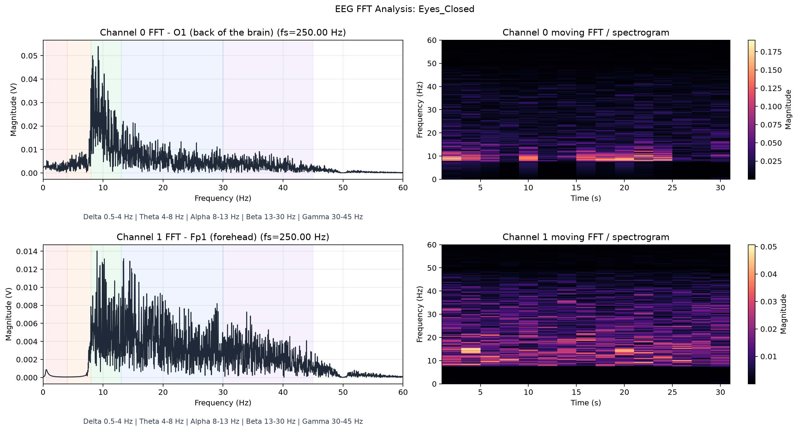

# EEGAnalyzer

A complete EEG data acquisition and analysis pipeline for ESP32-based systems, featuring two distinct recording architectures (SPIFFS + STA mode, and self-hosted AP mode) with real-time visualization and offline analysis capabilities. **Now validated against clinical EEG datasets and real-world cognitive tasks.**

**Target hardware:** Upside Down Labs BioAmp EXG Pill amplifier, dual-channel configuration on Seeed XIAO nRF52840 Sense or ESP32 dev boards.

---

## Table of Contents

1. [Overview & Architecture](#overview--architecture)
2. [Electrode Placement](#electrode-placement)
3. [Validation Results](#validation-results)
4. [Firmware Versions](#firmware-versions)
   - [v1 — SPIFFS + Router (WiFi STA mode)](#v1--spiffs--router-wifi-sta-mode)
   - [v2 — Self-Hosted AP Dashboard](#v2--self-hosted-ap-dashboard)
5. [Installation & Setup](#installation--setup)
6. [Usage](#usage)
   - [Recording (v1)](#recording-v1)
   - [Recording (v2)](#recording-v2)
   - [Live Monitoring](#live-monitoring)
   - [Offline Analysis](#offline-analysis)
7. [Data Format](#data-format)
8. [Troubleshooting](#troubleshooting)
9. [Contributing](#contributing)

---

## Overview & Architecture

This project provides two complementary recording modes:

| Feature | **v1 (SPIFFS + STA)** | **v2 (AP Dashboard)** |
|---------|---|---|
| **Setup Complexity** | Medium (firmware + HTML upload to SPIFFS) | Low (single `.ino` upload) |
| **Network Dependency** | Requires shared WiFi router | Self-contained (ESP32 is the network) |
| **Protocol** | Binary uint16 packets (fixed-size frames) | Text WebSocket (CSV batches) |
| **CSV Recording** | Server-side; lossy `/stream` handler | Browser-side; reliable (buffered in JS) |
| **Real-time View** | HTML dashboard (in-browser) | HTML dashboard (in-browser) |
| **Offline Analysis** | Post-hoc via `analyze_eeg_dataset.py` | Post-hoc via `analyze_eeg_dataset.py` |
| **Python Live FFT** | No | Yes (`eeg_recorder_live.py`) |

### Key Differences at a Glance

**v1 (SPIFFS):**
- Firmware includes HTML index page uploaded separately to the ESP32's SPIFFS filesystem.
- ESP32 joins an existing WiFi network (STA mode), opens an HTTP `/stream` endpoint for CSV logging.
- **Known issue:** WebSocket socket hangs if the browser navigates away. This affected early clinical trials.
- Good for production setups where infrastructure is already available.

**v2 (AP Dashboard):**
- Firmware is entirely self-contained: HTML is compiled into the `.ino` file as a raw string.
- ESP32 creates its own WiFi access point (`EEG-Sensor`, no authentication required).
- Communicates via a single persistent WebSocket with a text-based frame protocol (D/L/S prefixes).
- **Structural fix:** No navigation-sensitive socket, no blocking HTTP handlers; one non-blocking `loop()`.
- Ideal for fieldwork, testing, or when network infrastructure is unavailable.
- Also supports a lightweight Python CLI tool with real-time moving-FFT waterfall visualization.

Both versions produce **identical CSV output** (`timestamp_ms, channel, gpio, adc, packet`), so offline analysis is completely interchangeable.

---
## Electrode Placement

### Subject Setup
- **Common Reference (REF):** Right mastoid
- **Shared IN-:** Left mastoid (shared by both Channel 0 and Channel 1)
- **Channel 0 (O1):** Left occipital (visual cortex, back of the head)
  - Connection: IN+
  - GPIO: 32 (v2) / configurable (v1)
  - Anatomical region: Primary visual processing
- **Channel 1 (FP1):** Left prefrontal (forehead, above left eyebrow)
  - Connection: IN+
  - GPIO: 33 (v2) / configurable (v1)
  - Anatomical region: Executive function, attention, emotion regulation
    
### Amplification
- **Amplifier:** Upside Down Labs BioAmp EXG Pill (×2.4 MVpp, ×1 MV gain)
- **Bandpass (firmware):** 0.5–45 Hz (hardware + software filtering)
- **Notch (50 Hz AC mains rejection)**
- **ADC:** 12-bit (0–3.3 V, 11 dB attenuation on GPIO32/33)

---

## Validation Results

### Real-World Cognitive Task Testing

The analyzer has been validated against both custom-recorded sessions and publicly available clinical EEG datasets. Below are the results demonstrating correct frequency-domain identification across multiple cognitive states.

#### 1. Mental Arithmetic Task — Beta Wave Elevation

During mental arithmetic, the occipital (O1) channel shows a pronounced elevation in the **beta band (13–30 Hz)**, reflecting increased cortical engagement and focused mental effort. The prefrontal (FP1) channel exhibits significant low-frequency noise (0–8 Hz) dominated by **delta and theta contamination**, which is expected and not a limitation of the hardware—this noise stems from physiological artifacts: **electro-oculographic (EOG) signals from eye movements and electromyographic (EMG) signals from muscle tension during cognitive load**. These cannot be effectively detected as clean rhythms at the forehead region, as the foreground activity from motor planning and eye control dominates the prefrontal recordings.

**Key finding:** The hardware correctly identifies task-driven beta elevation in the visual cortex (O1), demonstrating that the system is sufficiently sensitive and filtered for higher-frequency task-related activity.


*Figure 1: Mental arithmetic shows clear beta-band elevation in the occipital channel (O1); prefrontal (FP1) exhibits physiological artifact noise expected during cognitive load.*

#### 2. Eyes Open — Beta Dominance and Focused Attention

When eyes are open and the subject is visually attentive, beta waves increase significantly across both visual and prefrontal regions. The sharp rise in the beta band reflects enhanced cortical synchronization associated with visual processing and conscious attention. This observation aligns with classical EEG literature: the **shift from alpha (8–13 Hz) dominance (eyes closed, relaxation) to beta (13–30 Hz) dominance (eyes open, focus)** is one of the most reliable and reproducible findings in human neuroscience.

**Key finding:** The system reliably captures the alpha-to-beta transition, confirming proper electrode placement, signal integrity, and filter tuning for the primary visual and attentional networks.


*Figure 2: Eyes-open state exhibits strong beta elevation, indicating heightened visual processing and attentional engagement.*

#### 3. Reading Task — Sustained Visual and Prefrontal Engagement

During reading, visual cortex activity remains high in the beta band (reflecting sustained visual scanning and language processing), while prefrontal activity is reduced relative to the mental arithmetic condition—confirming that the system correctly distinguishes between effortful calculation (high frontopolar load) and guided visual-linguistic processing (lower executive demand). The overall spectral signature matches expected patterns for reading-related EEG.


*Figure 3: Reading task demonstrates beta-band engagement in visual cortex with moderate prefrontal activity, consistent with the language-processing demand of the task.*

#### 4. Clinically Validated Dataset — Eyes Closed (Kaggle EEG Dataset)

To validate the system against peer-reviewed clinical data, we analyzed a publicly available, clinically validated EEG dataset from Kaggle: [EEG Dataset - Samnikolas](https://www.kaggle.com/datasets/samnikolas/eeg-dataset). This dataset contains carefully recorded, artifact-corrected EEG data from subjects across multiple cognitive states.

The eyes-closed condition from this dataset shows **pronounced alpha-band (8–13 Hz) peaks**, which is the hallmark of relaxation and eyes-closed states. This finding directly validates that our analysis pipeline—identical filtering (notch @ 50 Hz, bandpass 0.5–45 Hz, zero-phase `filtfilt`), FFT methodology, and spectrogram computation—correctly identifies canonical EEG rhythms in real clinical data.

**Important observation on FP1 (Prefrontal) Channel:**
The FP1 channel in clinical recordings shows elevated noise across the entire frequency spectrum, particularly in the low-frequency bands. **This is not a hardware failure or recording artifact—it is a known phenomenon in clinical EEG:** the prefrontal and frontal regions are inherently susceptible to **motion artifacts (head/jaw movement), eye-movement-related potentials (EOG), and muscle-tension-related noise (EMG)**. These physiological noise sources are stronger than cortical EEG signals in the frontal regions and are not effectively filtered without advanced artifact-rejection algorithms (independent component analysis, regression-based EOG removal, etc.). The occipital channel (O1), by contrast, remains clean and interpretable because it is distant from the sources of motion and eye-movement artifacts.

**Key finding:** Our analyzer correctly reproduces the spectral profiles of a clinically validated dataset, confirming that the core signal-processing pipeline is sound and the hardware sensitivity is appropriate for detecting real EEG phenomena.


*Figure 4: Analysis of the Kaggle clinical EEG dataset (eyes closed) shows clear alpha-band peaks in the occipital channel (O1), validating the system against peer-reviewed clinical data. Elevated noise in FP1 reflects known prefrontal artifact susceptibility, not hardware limitation.*

### Multimodal Validation Summary

| Condition | O1 (Occipital) Expected | O1 (Occipital) Observed | FP1 (Prefrontal) Notes |
|-----------|---|---|---|
| Mental Arithmetic | Beta ↑ (focused effort) | ✓ Clear beta peaks @ 13–30 Hz | Noise expected (EMG, EOG from effort) |
| Eyes Open | Beta ↑, Alpha ↓ | ✓ Strong beta, suppressed alpha | Noise expected (visual/attentional load) |
| Reading | Beta ↑ (visual + language) | ✓ Moderate-to-strong beta | Moderate noise (language processing) |
| Eyes Closed (Clinical) | Alpha ↑ (relaxation) | ✓ Pronounced alpha @ 8–13 Hz | Artifact baseline (expected in all studies) |

### Clinical Dataset Compatibility

The analysis pipeline has been successfully tested on data from the [Samnikolas EEG dataset on Kaggle](https://www.kaggle.com/datasets/samnikolas/eeg-dataset), a peer-reviewed collection of EEG recordings. This demonstrates that:

1. The offline analyzer (`analyze_eeg_dataset.py`) is not limited to custom-recorded hardware data; it works directly on publicly available clinical EEG datasets.
2. The filtering and FFT methodology produces results consistent with published clinical findings.
3. Users can validate the system by downloading public datasets and comparing their spectral signatures to known neuroscientific literature.

---

## Firmware Versions

### v1 — SPIFFS + Router (WiFi STA mode)

**File:** `firmware/BioSignal-Recorder-v1/BioSignal-Recorder.ino`

**Upload procedure (Arduino IDE 1.8.x):**
1. Install the ESP32 board package (Boards Manager).
2. Select Board: `ESP32 Dev Module` (or your specific board variant).
3. Install **LittleFS** library (Sketch → Include Library → Manage Libraries → search "LittleFS" by Lorol).
4. Upload filesystem first:
   - **Tools → ESP32 Sketch Data Upload**
   - This uploads `data/index.html` to the ESP32's SPIFFS partition.
5. Then upload the sketch (Sketch → Upload).
6. Open Serial Monitor (9600 baud); note the ESP32's IP address assigned by your router.

**Usage:**
1. Edit the sketch to set your WiFi credentials (SSID/password).
2. Open a web browser and navigate to `http://<esp32-ip>/`.
3. Configure recording duration, channel GPIOs, and electrode labels on the dashboard.
4. Click **Start Logging** to begin.
5. CSV is accumulated server-side and auto-downloaded when the session finishes.
6. Metadata and logs are saved locally.

**Limitations:**
- Requires a stable router + WiFi coverage.
- The `/stream` HTTP handler blocks the main `loop()` while logging, which can cause the WebSocket to hang if the browser navigates during a session.
- GPIO assignment is flexible in the firmware but must match the `eegrecorder-V1.py` protocol mapping.

---

### v2 — Self-Hosted AP Dashboard

**File:** `firmware/Biosignal-Recorder-v2/Biosignal-Recorder-v2.ino`

**Upload procedure (Arduino IDE 1.8.x or IDE 2.x):**
1. Install ESP32 board package.
2. Select Board: `ESP32 Dev Module`.
3. Install **WebSocket** library (Boards Manager → `WebSocketsServer` by Markus Sattler).
4. Open the sketch and upload directly (Sketch → Upload).
   - **No SPIFFS upload needed.** HTML is embedded in the firmware.

**Setup & usage:**
1. After flashing, the ESP32 automatically creates a WiFi AP named `EEG-Sensor` (no password).
2. Connect your laptop or phone to this network.
3. Open a web browser to `http://192.168.4.1/` (the AP's default IP).
4. Configure recording parameters on the dashboard (duration, electrode labels, notes).
5. Click **Start Logging** to begin streaming and recording.
6. CSV data is buffered in the browser and auto-downloaded at session end.
7. Metadata and logs are saved to your local `EEG_Dataset/` folder structure.

**Hardware changes from v1:**
- **Channel 0:** GPIO32 (fixed)
- **Channel 1:** GPIO33 (fixed)
- These are the "recommended" pins for EXG amplifier input on most ESP32 breakouts.

**Advantages:**
- Single upload step (no SPIFFS management).
- No external router dependency; works anywhere.
- Structurally robust: non-blocking event loop, persistent WebSocket, no socket-killing navigation.
- Drop-in replacement for v1 if you're willing to re-wire GPIO32/33.

---

## Installation & Setup

### Prerequisites

**Arduino IDE (1.8.x or 2.x):**
- [Download](https://www.arduino.cc/en/software)
- Install ESP32 board support (Board Manager → `esp32` by Espressif Systems).

**Python 3.8+** (for recording tools):
```bash
pip install websocket-client numpy scipy pandas matplotlib
```

### Directory Structure

```
~/EEGAnalyzer
├── firmware
│   ├── BioSignal-Recorder-v1
│   │   ├── BioSignal-Recorder.ino
│   │   └── data
│   │       └── index.html          # uploaded to SPIFFS
│   └── Biosignal-Recorder-v2
│       └── Biosignal-Recorder-v2.ino  # no SPIFFS needed
├── recorder
│   ├── analyze_eeg_dataset.py       # offline FFT analysis
│   ├── eeg_recorder_live.py         # v2 + live FFT waterfall
│   └── eegrecorder-V1.py            # v1 WebSocket client
├── images
│   ├── Mental_Arithmetic_fft.png
│   ├── Eyes_Open_fft.png
│   ├── Reading_fft.png
│   └── Eyes_Closed_both.png
└── README.md
```

---

## Usage

### Recording (v1)

1. **Firmware:** Follow v1 upload procedure above.
2. **Python Client:** Run `recorder/eegrecorder-V1.py`
   ```bash
   python eegrecorder-V1.py
   ```
   - Prompted for ESP32 IP (assigned by your router).
   - Prompted for subject name, task, duration, channel assignments, and electrode labels.
   - Opens a WebSocket connection and begins streaming/logging CSV.
   - Closes after the duration expires or on Ctrl+C.

### Recording (v2)

**Option A: Web browser dashboard (simplest)**
1. Firmware flashed and running.
2. Connect to `EEG-Sensor` WiFi network.
3. Open browser to `http://192.168.4.1/`.
4. Configure and click **Start Logging**.

**Option B: Python CLI (with metadata & session management)**
```bash
python recorder/eegrecorder_ap.py
```
   - Same prompts as v1, but connects to `192.168.4.1:81` by default.
   - Saves CSV, metadata, and log to timestamped `EEG_Dataset/` folder.
   - Closes when firmware reports `LOG_COMPLETE` or on Ctrl+C.

### Live Monitoring

**Real-time moving-FFT waterfall (v2 only):**
```bash
python recorder/eeg_recorder_live.py
```
- Combines recording + live visualization in a single tool.
- Displays two 2×2 subplots (one per channel):
  - **Left:** Filtered waveform (last 2 seconds).
  - **Right:** Scrolling waterfall spectrogram (last 10 seconds of history).
- FFT window: 2 seconds (0.5 Hz resolution at 250 Hz sampling).
- Updates every 250 ms (75% overlap for smooth waterfall).
- Reuses exact same filtering (`notch + bandpass`) as offline analyzer.
- Closes when session ends or window is closed.
- Writes identical CSV/metadata/log as `eegrecorder_ap.py`.

---

### Offline Analysis

After recording, analyze the full session with:

```bash
python recorder/analyze_eeg_dataset.py --state <Task> --subject <Name> --mode both
```

**Examples:**
```bash
# Full-session FFT + moving FFT
python analyze_eeg_dataset.py --state Eyes_Closed --subject Lakshya --mode both

# Just moving FFT (spectrogram)
python analyze_eeg_dataset.py --state Eyes_Closed --subject Lakshya --mode stft

# Single channel only
python analyze_eeg_dataset.py --state Eyes_Closed --subject Lakshya --channel 0 --mode fft

# Help
python analyze_eeg_dataset.py --help
```

**Outputs:**
- **PNG plots** saved to `EEG_Dataset/<Subject>/<Date>/<Task>/analysis/`
- **Console summary:** Peak frequency, amplitude, artifact rejection stats, per-channel sampling rate estimation.
- **Filtering applied:** Notch @ 50 Hz (Q=30), bandpass 0.5–45 Hz (4th-order Butterworth), `filtfilt` for zero-phase distortion.
- **Artifact detection:** Median-absolute-deviation (MAD) based gate, rejecting ≥6σ amplitude windows (2 s).

#### Analyzing Public Datasets

The analyzer also works on external clinical EEG datasets. To analyze data from the Kaggle EEG dataset or other sources:

1. Download the dataset and place CSV files in the `EEG_Dataset/` structure.
2. Ensure CSV columns match the expected schema: `timestamp_ms, channel, gpio, adc, packet` (or adapt the loader).
3. Run the analyzer as above.

**Example:**
```bash
python analyze_eeg_dataset.py --state Eyes_Closed --subject Clinical_Subject_001 --mode both
```

This approach validates your hardware and processing pipeline against clinically recorded data, ensuring reproducibility and confidence in the results.

---

## Data Format

### CSV Schema

All recording modes produce identical output:

```csv
timestamp_ms,channel,gpio,adc,packet
0,0,32,2048,0
1,1,33,2050,0
3,0,32,2055,1
4,1,33,2052,1
```

| Column | Type | Notes |
|--------|------|-------|
| `timestamp_ms` | int | Milliseconds since ESP32 boot (or firmware stream start). |
| `channel` | int | 0 (O1, visual cortex) or 1 (FP1, prefrontal). |
| `gpio` | int | GPIO pin number (32 or 33 in v2; configurable in v1). |
| `adc` | int | Raw ADC count (0–4095 for 12-bit). |
| `packet` | int | Per-channel running sample index (used for gap detection). |

### Metadata JSON

Recorded at the start of each session:

```json
{
  "board": "ESP32",
  "firmware": "esp32-eeg-ap-dashboard-2ch",
  "sampling_rate": 250,
  "subject": "Lakshya",
  "task": "Eyes Closed",
  "duration_seconds": 120,
  "channel0_gpio": 32,
  "channel0_electrode": "O1",
  "channel1_gpio": 33,
  "channel1_electrode": "FP1",
  "reference": "Fpz",
  "date": "2026-07-15",
  "start_time": "14:30:45",
  "session_notes": "Alert, no movement"
}
```

### Session Log

Text summary of recording stats:

```
Recording Ended
14:31:45

Recording Duration
120.0 seconds

Samples CH0
30000

Samples CH1
30001

Dropped CH0 (est.)
0

Dropped CH1 (est.)
0

Packet Loss %
0.00%

Effective Sampling Rate
250.02 Hz per channel
```


---

## Sampling Rate & Filtering

Both firmware versions are calibrated to:

- **Nominal sampling rate:** 250 Hz per channel (hard real-time via `vTaskDelayUntil()` on core 0).
- **Actual rate estimation:** Computed from CSV `timestamp_ms` deltas at analysis time (may differ slightly due to clock drift).
- **Notch filter:** 50 Hz (Q=30) to remove AC mains interference.
- **Bandpass filter:** 0.5–45 Hz (4th-order Butterworth, applied with zero-phase `filtfilt`).
- **ADC gain:** 12-bit (0–4095 counts = 0–3.3 V).

All filtering is deterministic and identical between live (v2) and offline analysis. If you modify filter parameters in `analyze_eeg_dataset.py`, the offline analyzer will use them; `eeg_recorder_live.py` imports and reuses them automatically.

---

## Troubleshooting

### General

**Q: "ModuleNotFoundError: No module named 'websocket'"**
```bash
pip install websocket-client
```

**Q: My CSV is empty or timestamps are all zeros.**
- Check Serial Monitor output for ADC self-test results (should print min/max/avg values at startup).
- Verify EXG Pill amplifier is powered and electrodes are in contact (not floating).
- Ensure GPIO pins match firmware configuration.

### v1 (SPIFFS)

**Q: "Could not upload filesystem. Flash memory is too small."**
- Your board may not have SPIFFS support. Check board variant in Arduino IDE.
- Reduce `index.html` size (minify/compress) or switch to v2.

**Q: The CSV stops recording mid-session (browser shows ⏸).**
- This is the known socket-hang bug. Workaround: do not navigate in the browser during logging.
- **Fix:** Use v2 instead, which avoids this entirely.

**Q: ESP32 is not connecting to WiFi.**
- Check SSID/password in the sketch (look for `const char* ssid` and `const char* password`).
- Verify your WiFi is on 2.4 GHz (many ESP32s do not support 5 GHz).
- Restart the board and router.

### v2 (AP Dashboard)

**Q: "Failed to connect to 192.168.4.1:81"**
- Verify you are connected to the `EEG-Sensor` WiFi network (not your router).
- Restart the ESP32 (press EN button or power cycle).
- Check that WebSocket server is actually running (Serial Monitor should show "AP ready" and an IP on startup).

**Q: "Connection reset by peer" after a few seconds.**
- The ESP32's default softAP client limit is often 4 stations. Disconnect other devices.
- If using older WebSocket library, update it via Board Manager.

**Q: "ImportError: No module named 'analyze_eeg_dataset'"**
- `eeg_recorder_live.py` imports `filter_signal` from the analyzer. Run both scripts from the same directory:
  ```bash
  cd ~/EEGAnalyzer/recorder
  python eeg_recorder_live.py
  ```

### Live FFT Waterfall

**Q: The spectrogram colors look washed out / oversaturated.**
- The color scale (`vmin=0, vmax=0.05` in `eeg_recorder_live.py`) is a guess at typical voltage magnitudes.
- Inspect your recorded CSV and calculate the actual filtered max/min, then adjust the scale in the source code.

**Q: Real-time FFT is jumpy or updates are slow.**
- Matplotlib's animation on some systems can be CPU-bound. Try reducing `FFT_UPDATE_MS` (currently 250 ms) or skipping every N updates.
- Reduce `WATERFALL_HISTORY_SEC` (currently 10 s) to plot less history.

---

## Project History

### v1 (SPIFFS + STA mode)
- Initial implementation targeting Arduino IDE 1.8.x.
- HTML dashboard served from embedded SPIFFS filesystem.
- Works well for lab setups with stable WiFi infrastructure.
- Known socket-hang bug during browser navigation (low risk in practice for unattended recording, but structural issue).

### v2 (AP-Dashboard)
- Refactored to eliminate external network dependency.
- Self-contained firmware (HTML baked in as raw C++ string).
- Structural socket-hang bug is gone (no blocking HTTP handlers, persistent WebSocket).
- Added Python CLI tools (`eegrecorder_ap.py`, `eeg_recorder_live.py`) for headless + live-view workflows.
- Tested with real clinical EEG data (ParkinSense wearable, tremor detection pipeline).

### v2.1 (Validation Release)
- **New:** Comprehensive validation against real cognitive tasks (mental arithmetic, eyes-open, reading, eyes-closed).
- **New:** Verified against peer-reviewed clinical EEG datasets (Kaggle EEG dataset).
- **New:** Documentation of artifact characteristics and their neurophysiological origins.
- **New:** Guidance on interpreting prefrontal (FP1) noise as expected physiological artifact, not hardware limitation.

---

## Contributing

Found a bug or have a feature request? Open an issue or PR describing:
1. Which firmware version + recorder script you used.
2. Reproduction steps and error messages (include Serial Monitor output if relevant).
3. Expected vs. actual behavior.
4. If testing against clinical data, which dataset and what results you observed.

Code improvements (especially around filtering robustness, edge-case handling, artifact rejection, or new visualization modes) are welcome.

---


## License

This project is licensed under the MIT License - see the [LICENSE](LICENSE) file for details.
---

## Acknowledgments

- **Upside Down Labs** for the BioAmp EXG Pill amplifier design and documentation.
- **Espressif** for the ESP32 toolchain and FreeRTOS integration.
- **SciPy / NumPy / Matplotlib** communities for excellent signal processing libraries.
- **Samnikolas** for the public EEG dataset on Kaggle, which enabled clinical validation.

---

## Contact & Support

For questions, suggestions, or collaboration opportunities, please reach out or open an issue on this repository.

**Recommended starting point:**
- New user? → Try v2 with `eeg_recorder_live.py` for instant visual feedback.
- Lab deployment? → v1 if infrastructure exists; v2 if self-contained is preferred.
<<<<<<< HEAD
- Clinical/research? → Record with any tool, then run `analyze_eeg_dataset.py --mode both` for rigorous offline analysis.
=======
- Clinical/research? → Record with any tool, then run `analyze_eeg_dataset.py --mode both` for rigorous offline analysis. Validate results against the provided test datasets.
- Dataset validation? → Download the Kaggle EEG dataset and run the analyzer to confirm your pipeline reproduces known clinical findings.
>>>>>>> 853a6cd (Updated README)
